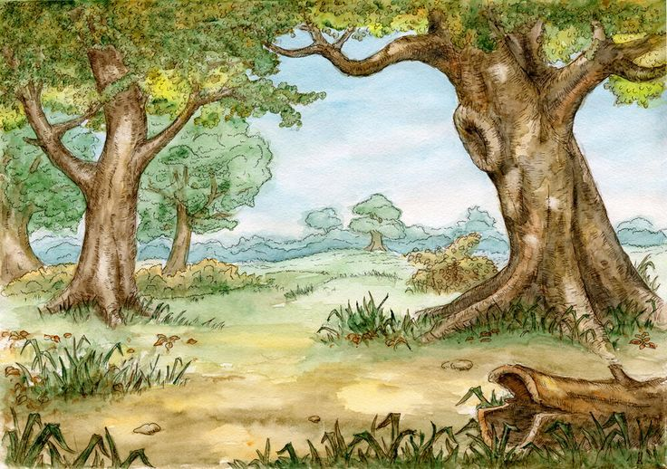
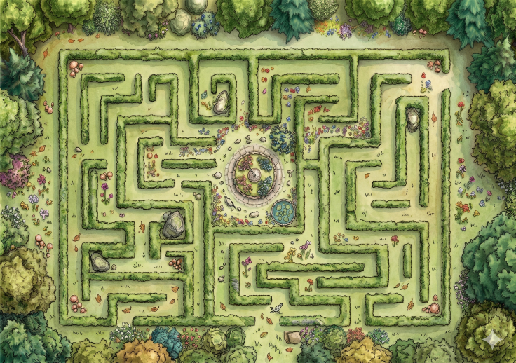
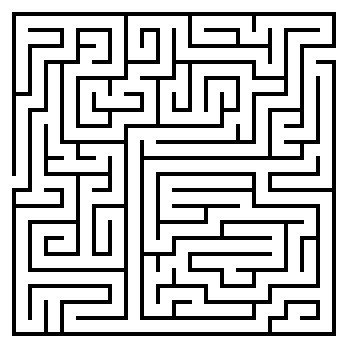
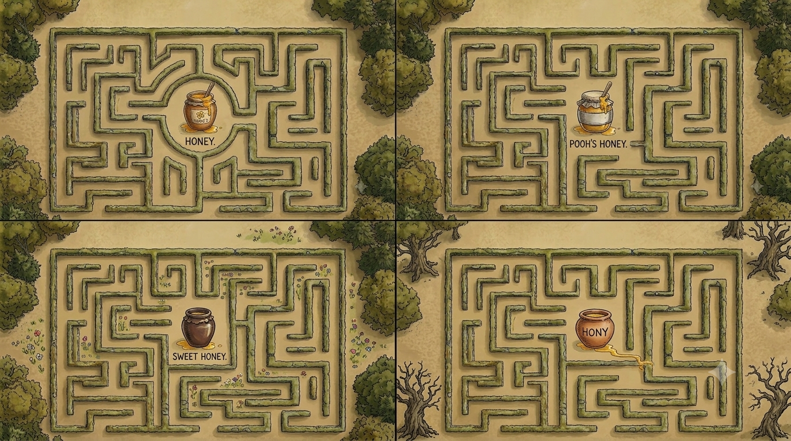
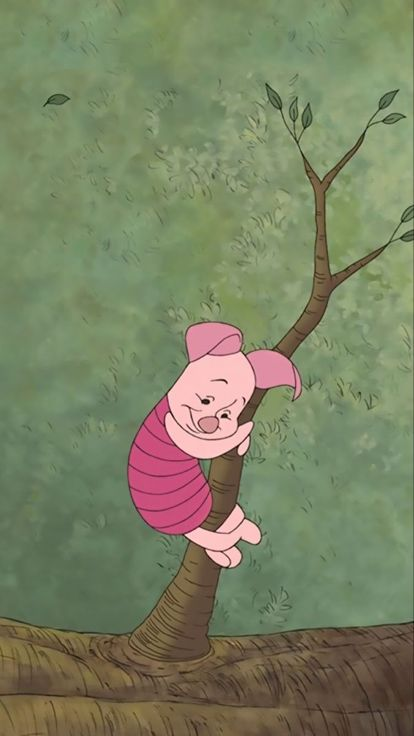
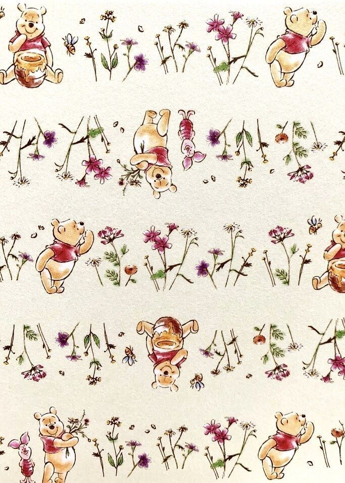

# Bitácora Examen: Proyecto de Interacción
**Estudiante:** Josefa Navas  
**Asignatura:** Pensamiento Computacional - Entrega de Examen  
**Nombre del Proyecto:** Interactividad Animada  
**Fecha de Entrega:** 26 Junio, 2026

## Fundamento de Diseño y Concepto de Interacción

La propuesta estética y el lenguaje visual de este proyecto están directamente inspirados en el universo de la serie animada **Winnie de Pooh**. Bajo la premisa de evocar una atmósfera infantil, lúdica y nostálgica, el software se articula como un entorno dinámico enfocado en la **interactividad obligatoria entre el usuario y el programa**

Alineado con esta narrativa infantil, el sistema no funciona como una animación lineal o estática, sino como una experiencia modular dividida en **4 páginas autónomas**. Cada escena posee motivos de movimiento independientes y mecánicas particulares, donde el código reacciona de forma única a los estímulos del espectador a través del hardware o de cálculos geométricos en tiempo real.

Para reforzar la identidad visual del proyecto, **las ilustraciones base fueron aplicadas directamente mediante el comando de fondo (`background`)**. Esta decisión técnica se tomó con el objetivo de estructurar una puesta en escena limpia y de alta fidelidad que permitiera al usuario asimilar y comprender con mayor facilidad el concepto animado y lúdico de la experiencia en cada transición.

Asimismo, bajo criterios de diseño de interfaz, **en las páginas 1 y 2 se incorporó una figura base semitransparente detrás de los textos**. Esta capa geométrica actúa como un contenedor de alto contraste que asegura la legibilidad de las instrucciones, impidiendo que los caracteres tipográficos se pierdan o confundan con las texturas y tonalidades de las ilustraciones de fondo, guiando así la navegación del usuario con total claridad.

---

## 🖼️ Imágenes Utilizadas en el Desarrollo del Programa

### Escenografía y Referentes Visuales:
* **Fondo del Bosque (Estado 0):**
[imagen del bosque original de la animacion]

* **Interfaz del Laberinto (Estado 1):**
La imagen base utilizada para el entorno del laberinto fue co-creada con la herramienta de Inteligencia Artificial **Gemini**, utilizando dos imágenes de referencia para guiar su composición. En un costado del lienzo se conserva la marca de agua original de Gemini; se decidió mantener este elemento de manera explícita con el fin de reconocer y validar el uso de la IA como un asistente técnico y creativo válido dentro del proceso de desarrollo.
[generado con Gemini]

* **Referencias de Cocreación para el Laberinto:**

* 

* **Ilustración de Piglet (Estado 2):**

[imagen de la serie animada]

* **Fondo de Winnie de Pooh (Estado 3):**
[imagen descargada de Pinterest]

---

##  Estructura de Páginas y Comandos Principales

###  Página 1: Pantalla de Bienvenida (Estado 0)
* **Concepto:** Introducción al entorno lúdico del bosque con el vuelo autónomo de una abeja].
* **Interacción:** Movimiento azaroso automatizado que simula vida independiente mediante un freno de fotogramas[cite: 1]. Legibilidad optimizada mediante caja contenedora semitransparente.
* **Comandos Clave:** `background()`, `fill()` con canal Alfa (opacidad), `rect()`, `random()`, `frameCount`, `text()`[cite: 1].

###  Página 2: El Laberinto Activo (Estado 1)
* **Concepto:** Navegación guiada por el usuario para trasladar a la entidad a través de un mapa geométrico.
* **Interacción:** Control directo por hardware. El movimiento responde exclusivamente a las pulsaciones físicas del usuario[cite: 1]. Bloque instructivo protegido visualmente por base traslúcida.
* **Comandos Clave:** `background()`, `fill()` con canal Alfa (opacidad), `rect()`, `keyPressed()`, `keyCode`, `LEFT_ARROW`, `RIGHT_ARROW`, `UP_ARROW`, `DOWN_ARROW`.

###  Página 3: Transición Óptica de Piglet (Estado 2)
* **Concepto:** Intermedio cinético que deforma la ilustración del personaje en el árbol basándose en la posición del cursor.
* **Interacción:** Desfase analógico. El sistema mide las coordenadas del mouse para generar un efecto de "glitch cromático" por superposición.
* **Comandos Clave:** `background()`, `mouseX`, `mouseY`, `tint()`, `blendMode(ADD)`, `noTint()`.

###  Página 4: Grilla Matemática de Pooh (Estado 3)
* **Concepto:** Cuadrícula masiva de pupilas interactivas que siguen de forma orgánica la presencia del espectador.
* **Interacción:** Orientación trigonométrica vectorial y escalamiento dinámico por cercanía al cursor.
* **Comandos Clave:** Loops `for` anidados, `background()`, `atan2()`, `dist()`, `map()`, `cos()`, `sin()`.

---

## 🖱️ El Vínculo de Control: `mousePressed()`
La transición secuencial que permite avanzar a través de estas páginas con movimientos independientes está completamente supeditada a la voluntad del espectador. Mediante la función `mousePressed()`, el sistema evalúa la intención del usuario para cambiar de un estado a otro, demostrando que **el software requiere de la acción humana para completarse y cobrar sentido.**.
